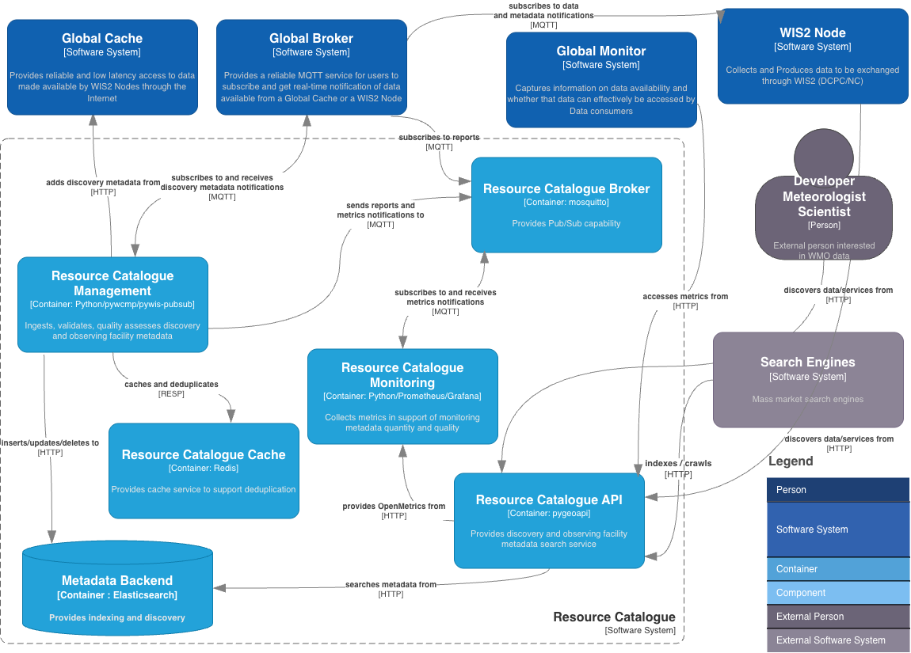

[](https://github.com/wmo-im/wmo-resource-catalogue/actions)

# wmo-resource-catalogue

wmo-resource-catalogue is a Reference Implementation of a WIS2 Global Discovery Catalogue and WIGOS Global Observing Facility Catalogue.

<a href="docs/architecture/c4.container.png"></a>

## Workflow

- connects to a WIS2 Global Broker, subscribed to the following topic:
  - `cache/a/wis2/+/metadata`
  - `cache/a/wigos/+/metadata`
- on discovery metadata and observing facility metadata notifications:
  - check for message duplication
  - for WIS2, run the WCMP2 ETS and KPIs via [pywcmp](https://github.com/World-Meteorological-Organization/pywcmp)
  - for WIGOS, run the WMDR2 ETS via [pywmdr](https://github.com/wmo-im/pywmdr)
- publish ETS and KPI reports to local broker:
  - for WIS2,  under `monitor/a/wis2/<centre-id>`
  - for WIGOS,  under `monitor/a/wigos/<centre-id>`
- publish to a WIS2 GDC or WIGOS GOFC ([OGC API - Records](https://docs.ogc.org/is/20-004r1/20-004r1.html)) using one of the supported transaction backends:
  - [OGC API - Features - Part 4: Create, Replace, Update and Delete](https://docs.ogc.org/DRAFTS/20-002.html)
  - Elasticsearch direct (default)
- collect real-time and offline GDC and GOFC metrics and make them available as [OpenMetrics](https://openmetrics.io)
- provide analytics and visualization via [Prometheus](https://prometheus.io) and [Grafana](https://grafana.com)
- produce a metadata zipfile archive for download (daily)

## Installation

### Requirements
- Docker

### Dependencies
Dependencies are embedded in service definitions and orchestrated by Docker.

### Installing wmo-resource-catalogue

```bash
# setup virtualenv
python3 -m venv --system-site-packages wmo-resource-catalogue
cd wmo-resource-catalogue
source bin/activate

# clone codebase and install
git clone https://github.com/wmo-im/wmo-resource-catalogue.git
cd wmo-resource-catalogue/wmo-resource-catalogue-management
make build
make up
```

## Running


### Docker

The Docker setup uses Docker and Docker Compose to manage the following services:

- **wmo-resource-catalogue-api**: API powered by [pygeoapi](https://pygeoapi.io)
- **wmo-resource-catalogue-monitoring**: monitoring
  - **wmo-resource-catalogue-metrics-collector**: metrics collector
  - **wmo-resource-catalogue-prometheus**: metrics scraper
  - **wmo-resource-catalogue-grafana**: analytics and visualization
- **wmo-resource-catalogue-broker**: MQTT broker
- **wmo-resource-catalogue-management**: management service to ingest, validate and publish discovery metadata published from a WIS2 Global Broker instance
  - the default Global Broker connection is to MétéoFrance.  This can be modified in `wmo-resource-catalogue.env` to point to a different Global Broker
- **wmo-resource-catalogue-backend**: API search engine backend (default Elasticsearch)
- **wmo-resource-catalogue-cache**: message cache (default Redis)

See [`wmo-resource-catalogue.env`](wmo-resource-catalogue.env) for default environment variable settings.

To adjust service ports, edit [`docker-compose.override.yml`](docker-compose.override.yml) accordingly.

The [`Makefile`](Makefile) in the root directory provides options to manage the Docker Compose setup.

```bash
# build all images
make build

# build all images (no cache)
make force-build

# start all containers
make up

# reinitialize backend
make reinit-backend

# start all containers in dev mode
make dev

# view all container logs in realtime
make logs

# login to the wmo-resource-catalogue-management container
make login

# restart all containers
make restart

# shutdown all containers
make down

# remove all volumes
make rm

# monitor running containers
make ps
```

## Development

### Running Tests

TODO

### Code Conventions

* [PEP8](https://www.python.org/dev/peps/pep-0008)

### Bugs and Issues

All bugs, enhancements and issues are managed on [GitHub](https://github.com/wmo-im/wmo-resource-catalogue/issues).

## Contact

* [Tom Kralidis](https://github.com/tomkralidis)
