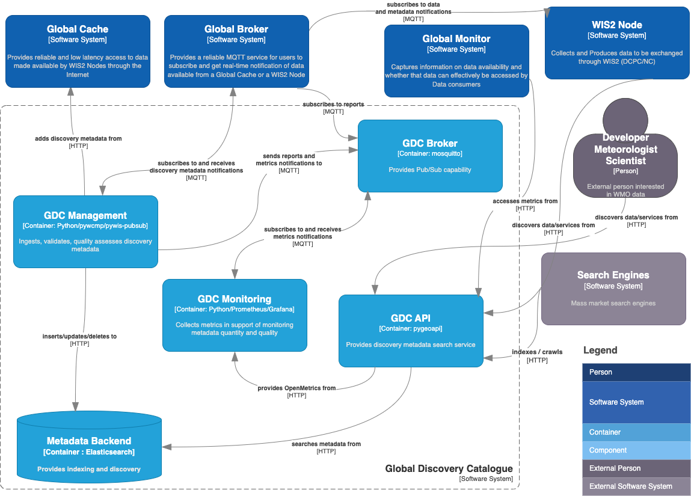

[](https://github.com/wmo-im/wis2-gdc/actions)

# wis2-gdc

wis2-gdc is a Reference Implementation of a WIS2 Global Discovery Catalogue.

<a href="docs/architecture/c4.container.png"></a>

## Workflow

- connects to a WIS2 Global Broker, subscribed to the following topic:
  - `cache/a/wis2/+/metadata`
- on discovery metadata notifications:
  - check for message duplication
  - run the WCMP2 ETS and KPIs via [pywcmp](https://github.com/World-Meteorological-Organization/pywcmp)
- publish ETS and KPI reports to local broker under `monitor/a/wis2/centre-id`
- publish to a WIS2 GDC ([OGC API - Records](https://docs.ogc.org/is/20-004r1/20-004r1.html)) using one of the supported transaction backends:
  - [OGC API - Features - Part 4: Create, Replace, Update and Delete](https://docs.ogc.org/DRAFTS/20-002.html)
  - Elasticsearch direct (default)
- collect real-time and offline GDC metrics and make them available as [OpenMetrics](https://openmetrics.io)
- provide analytics and visualization via [Prometheus](https://prometheus.io) and [Grafana](https://grafana.com)
- produce a metadata zipfile archive for download (daily)

## Installation

### Requirements
- Docker

### Dependencies
Dependencies are embedded in service definitions and orchestrated by Docker.

### Installing wis2-gdc

```bash
# setup virtualenv
python3 -m venv --system-site-packages wis2-gdc
cd wis2-gdc
source bin/activate

# clone codebase and install
git clone https://github.com/wmo-im/wis2-gdc.git
cd wis2-gdc/wis2-gdc-management
pip3 install .
```

## Running

```bash
# setup environment and configuration
cp wis2-gdc.env local.env
vim local.env # update accordingly

source local.env

# setup pywis-pubsub - sync WIS2 notification schema
pywis-pubsub schema sync

# setup backend
wis2-gdc setup

# setup backend (force reinitialization of backend)
wis2-gdc setup --force

# teardown backend
wis2-gdc teardown

# connect to Global Broker
# discovery metadata notifications will automatically trigger wis2-gdc to validate and publish
# WCMP2 to the GDC identified in wis2-gdc.env (WIS2_GDC_GB)
pywis-pubsub subscribe --config pywis-pubsub.yml

# loading metadata manually (single file)
wis2-gdc register /path/to/wcmp2-file.json

# loading metadata manually (directory of .json files)
wis2-gdc register /path/to/dir/of/wcmp2-files

# loading metadata manually (from URL)
wis2-gdc register https://example.org/wcmp2-file.json

# deleting metadata by identifier
wis2-gdc unregister "urn:wmo:md:ca-eccc-msc:id123"

# loading metadata from a known harvest endpoint

# load from wis2box known deployments (https://demo.wis2box.wis.wmo.int)
wis2-gdc sync wis2box

# create an archive of metadata records to a zipfile
wis2-gdc archive foo.zip

# restore an archive of metadata records from a zipfile
wis2-gdc restore wis2-discovery-metadata.zip
```

### Docker

The Docker setup uses Docker and Docker Compose to manage the following services:

- **wis2-gdc-api**: API powered by [pygeoapi](https://pygeoapi.io)
- **wis2-gdc-monitoring**: monitoring
  - **metrics-collector**: metrics collector
  - **prometheus**: metrics scraper
  - **grafana**: analytics and visualization
- **wis2-gdc-broker**: MQTT broker
- **wis2-gdc-management**: management service to ingest, validate and publish discovery metadata published from a WIS2 Global Broker instance
  - the default Global Broker connection is to NOAA.  This can be modified in `wis2-gdc.env` to point to a different Global Broker
- **wis2-gdc-backend**: API search engine backend (default Elasticsearch)
- **wis2-gdc-cache**: message cache (default Redis)

See [`wis2-gdc.env`](wis2-gdc.env) for default environment variable settings.

To adjust service ports, edit [`docker-compose.override.yml`](docker-compose.override.yml) accordingly.

The [`Makefile`](Makefile) in the root directory provides options to manage the Docker Compose setup.

```bash
# build all images
make build

# build all images (no cache)
make force-build

# start all containers
make up

# reinitialize backend
make reinit-backend

# start all containers in dev mode
make dev

# view all container logs in realtime
make logs

# login to the wis2-gdc-management container
make login

# restart all containers
make restart

# shutdown all containers
make down

# remove all volumes
make rm
```

## Development

### Running Tests

```bash
# install dev requirements
pip3 install -r requirements-dev.txt

# run tests like this:
python3 tests/run_tests.py

# or this:
python3 setup.py test
```

### Code Conventions

* [PEP8](https://www.python.org/dev/peps/pep-0008)

### Bugs and Issues

All bugs, enhancements and issues are managed on [GitHub](https://github.com/wmo-im/wis2-gdc/issues).

## Contact

* [Tom Kralidis](https://github.com/tomkralidis)
