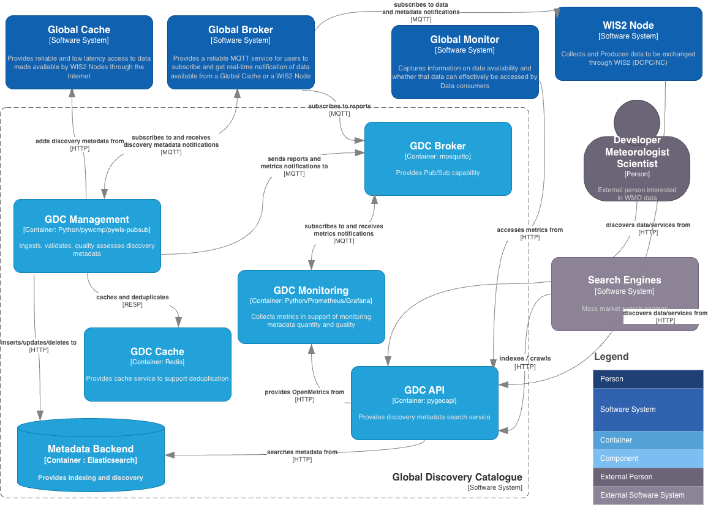

.. _architecture:

Architecture
============

``wis2-gdc`` is implemented in the spirit of the `Twelve-Factor App methodology`_.

``wis2-gdc`` is a `Docker`_ and `Python`_-based platform in support of WIS2 metadata
management, publication, and discovery.

High level system context
-------------------------

The following diagram provides a high level overview of the main functions
of ``wis2-gdc``:

How ``wis2-gdc`` works
----------------------

As a containerized solution, ``wis2-gdc`` provides functionality via the following services:

* **wis2-gdc-management**: ingests, validates and publishes discovery metadata published from a WIS2 Global Broker instance
* **wis2-gdc-api**: API powered by `pygeoapi`_
* **wis2-gdc-monitoring**: monitoring

  * **metrics-collector**: metrics collector
  * **prometheus**: metrics scraper
  * **grafana**: analytics and visualization
* **wis2-gdc-broker**: MQTT broker
* **wis2-gdc-backend**: API search engine backend (default Elasticsearch)
* **wis2-gdc-cache**: message cache (default Redis)

``wis2-gdc`` is primarily an event-driven system, also providing interactive functionality for managing WIS2 metadata if required.

Workflows
^^^^^^^^^

``wis2-gdc`` starts up by connecting to one or more WIS2 Global Brokers (GB), subscribing to notifications for WIS2 metadata (WMO Core Metadata Profile [WCMP2]).  On receipt of WIS2 Notification Messages (WNM) for metadata, ``wis2-gdc`` will perform message deduplication, validate, ingest and publish a WCMP2 record to its catalogue API.  In addition, WCMP2 update and deletion is supported with the appropriate WNM.

The ``wis2-gdc`` monitoring capability collects and provides metrics on WCMP2 that is scraped by the WIS2 Global Monitor (GM).

``wis2-gdc`` also provides its own MQTT broker that provides WCMP2 compliance and key performance indicator (KPI) reports.  The WIS2 GB subscribes to the ``wis2-gdc`` broker in order to publish these reports back to users (available on WIS2 topic ``monitor/a/wis2/CENTRE_ID_OF_DATA_PUBLISHER>`` for data providers in support of quality assessment, scoring and corrective action.  The ``wis2-gdc`` broker also acts as an internal message bus for inter-application event handling.

The ``wis2-gdc`` API provides an OGC API - Records endpoint that is OGC compliant.  The API provides search engine capability for WIS2 metadata, also providing OGC API - Processes functionality for WCMP2 validation and KPI quality assessment.

The ``wis2-gdc-management`` container provides functionality to restore a WCMP2 metadata archive zipfile from another GDC.  Note that ETS and KPI validations are not performed during a restore workflow.

.. _`Twelve-Factor App methodology`: https://12factor.net
.. _`Docker`: https://www.docker.com
.. _`Python`: https://www.python.org
.. _`pygeoapi`: https://pygeoapi.io
